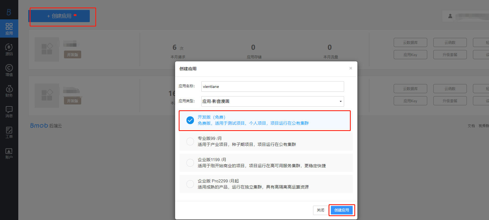
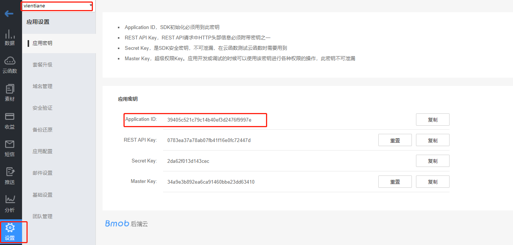

Vientiane 全网Vip影院，是基于[101影院](https://www.101yingyuan.net) 设计的一款在线视频播放安卓端应用软件，具体实现及部署方法如下

## 技术架构

:ballot_box_with_check: 基于[**Jsoup**](https://github.com/jhy/jsoup) 的数据抓取

:ballot_box_with_check: 使用[**BaseRecyclerViewAdapterHelper3.X**](https://github.com/CymChad/BaseRecyclerViewAdapterHelper)作为APP的RecycleView Adapter

:ballot_box_with_check: **Glidle**图片处理

:ballot_box_with_check: **Permission** 处理APP内权限请求

:ballot_box_with_check: 基于[**Bmob后端云 **](https://www.bmob.cn/)处理后台接口处理

:ballot_box_with_check: **Tencent Web X5** Video Player

## Vientiane特点

- 支持全网影视VIP免费观看

- 基于网页的数据抓取，实时更新，抓取速度快
- 全局数据缓存，APP启动速度快

## Vientiane图片预览

**主界面展示**

播放视频界面

## 部署教程

### 导入AndroidStudio

Vientiane基于Android Studio4.X开发，兼容 minSdkVersion 21 以上安卓设备，直接 clone 后导入AndroidStudio即可

~~~shell
git clone https://github.com/wjjer/vientiane.git
~~~

### 注册Bmob

在此处 [**注册Bmob**](https://www.bmob.cn/register) ，注册后，然后新建一个应用

进入创建完成的应用，复制Application ID

将复制好的Application ID粘贴到应用的Constant文件

~~~shell
# 编辑 vip.ablog.vientiane.constant.Constant 配置Bmob SDK

public static final String BMOB_SDK_ID = "改为自己的SDK_ID";
~~~

### 配置数据库文件

将 database下的 csv 数据文件导入到bmob数据库中，下面是数据表的详解

~~~shell
AppVersion.csv 用于记录APP版本信息，提醒软件版本更新
UserAnalyze.csv 用于记录APP的用户使用信息，例如注册时间、最近一次使用时间、是否激活APP等
~~~

## 技术支持

如果软件部署使用过程中出现任何问题可以关注公众号 `AB小站` 获取技术支持，关注AB小站可获得更多技术教程，或者访问官网 [AB小站](http://Ablog.vip)

